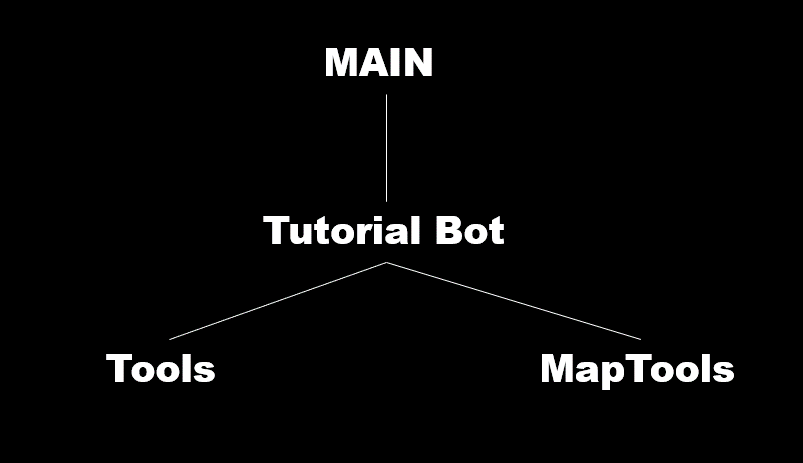

# Tutorial Bot
튜토리얼 봇은 가장 기초적인 기능만을 수행하는 봇으로 스타크래프트 봇 동아리에서 
사용되는 봇입니다.

<h2>Tutorial Bot을 만든 이유</h2>
기존에 사용했던 소스는 BWAPI 4.1.2 버전을 사용하는 JMirror를 사용하였으며,
NullPointerException예외가 발생할 경우, JVM Crash가 발생하는 경우가 종종 나왔으며,
BWAPI 4.1.2 버전에 국한되는 것이 아닌 최신 버전 역시 사용하고자 JBWAPI를 사용하여 
더 쉽고 간단하게 개발하게 되었습니다.

<h2>무엇이 바뀌었을 까</h2>
라이브러리: JMirror -> JBWAPI  
소스코드: 복잡한 로직과 중복 코드 -> 중복 코드 X, 제네릭 사용 및 코드 단순화

<h2>동작 원리</h2>

<h2>기능</h2>

* 맵 표시
* 미네랄 채취
* 일꾼 생산  
* 인구수 건물 건설  
* 유닛 체력 표시  
* 디버그 표시

<h2>사용 방법</h2>
BWAPI 4.4.0 설치
StarCraft 1.16.1 설치
IntelliJ 혹은 Eclipse 설치
JDK 1.8 설치
JBWAPI MAVEN 혹은 Gradle 로 설치
해당 Tutorial 소스 다운로드
File -> Open -> Tutorial 소스 파일 열기

BWAPI ChaosLauncher (MultiInstance.exe)을 관리자로 실행
Tutorial 소스 파일에 있는 Main 클래스 Run  
플레이는 반드시 1 대 1로 플레이, Tutorial Bot은 테란만 가능합니다.

<h2>License</h2>
<a href=https://github.com/davechurchill/STARTcraft>
    dave churchill's STARTcraft
</a>
를 자바로 바꾸어 개발하였습니다. 

